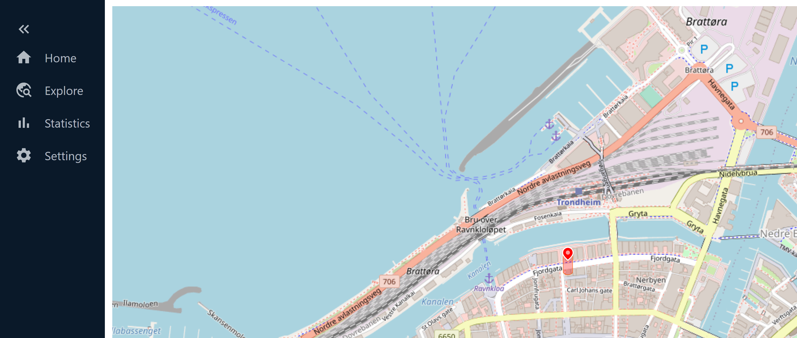

---
author:
- Luis Fernando Sanchez Martin
date: July 2023
title: RVG DSS Manual
---

# Introduction

This document is meant to serve as a technical manual on the modules,
functionality, and operation of the RVG DSS Repo/ Application

This project is meant to be a Decision Support System for Research
Vessel Gunnerus. It receives real-time data from RVG's onboard computer
containing NMEA and AIS data, processes it, and provides a visual output
as an Electronic Chart (EC) accessible through a web application.
Additionally, a server-like application is used, in order to make this
web application remotely available.

On top of this, the project includes modules to allow replay of
previously obtained data. run 4DOF simulations based on RVG models, and
collision avoidance algorithms. These functionalities shall be further
expanded in the following sections.

A monolithic repository containing the project can be found
[here,](https://github.com/luisanch/RVG_DSS)

## Overview

The project is divided into three main components, the
`rvg_leidarstein_frontend`, the `rvg_leidarstein_msg_relay`, and the
`rvg_leidarstein_core`. This last one is the most extensive of the
three.

A short breakdown of the functionality of these components is as
follows:

-   `rvg_leidarstein_frontend`: this is the front-end implementation,
    which provides visual information related to RVG, This receives data
    via WebSocket through the `rvg_leidarstein_msg_relay` and displays
    it on a digital electronic chart. This web application is based on
    React.js.

-   `rvg_leidarstein_msg_relay`: This functions as a bridge that allows
    communicating the output of the `rvg_leidarstein_core` to the
    `rvg_leidarstein_frontend`. Although establishing direct
    communication between the `rvg_leidarstein_core` and the
    `rvg_leidarstein_frontend` is possible; the
    `rvg_leidarstein_msg_relay` allows for remote access to the data in
    both directions. This implementation should be revised.

-   `rvg_leidarstein_core`: this is the most extensive component in the
    stack. this handles the communication between RVG and the
    Application, the processing of the raw messages into usable data,
    the execution of the DSS algorithms, and finally the relay of
    pertinent data to the `rvg_leidarstein_frontend`. This module is due
    to be refactored in order to improve its functionality.

The following sections will present each of the main components,
beginning with the installation and execution steps.

# Frontend

`rvg_leidarstein_frontend`

## Installation and execution

Node is required to run this component: `cd` into the
`rvg_leidarstein_frontend` directory and

        npm install
        npm start

after the first install, only the `npm start` command is necessary for
its execution.

This should launch the react web application in a browser,
although it will do nothing unless the `rvg_leidarstein_msg_relay` and
the `rvg_leidarstein_core` components are also running.

# Message Relay

`rvg_leidarstein_msg_relay`

## Installation and Execution

`cd` into the `rvg_leidarstein_msg_relay` directory and

        python .\scripts\run_leidarstein.py

Following this, the connections made to the server will be displayed in
the same console.

# Core

`rvg_leidarstein_core`

## Installation and Execution

Although installation in and of itself is not required for running this
component, it is necessary to have the Python dependencies required for
this project. At the time of writing this manual, it is suggested to use
the conda environment manager to install the required packages by
creating an environment from the provided `rvgdss.yml` file. However, a
python `venv` solution is being worked on. At any rate the packages
described in the yml file are required in addition to the packages
mentioned in the quickstart guide.

Once these dependencies are met, the component can be executed by

        python .\scripts\run_leidarstein.py

Alternatively, a log containing raw data can be passed as an argument
for the component to use as a data source by using `-f`

        python .\scripts\run_leidarstein.py -f path/to/file

Upon execution, the following messages will be displayed in the console
indicating that it is running:

    StreamParser running.
    DataLogger running.
    Simulation 4DOF Client running...
    Colav Manager running...

## Description

The entry point for this component is the `rvg_leidarstein_frontend`
script. This script contains the main execution loop and instantiates
the main components of the `rvg_leidarstein_core`. The `ColavManager`
component is also instantiated here since it is included in the main
loop in order to run it as an individual process, as `cbf_process`
requires additional resources to run in a timely fashion. Colav Manager
aside, most of the functionality of this application is wrapped inside
of the `DataModel` component itself. It is worth mentioning that some of
the naming conventions in this app are holdovers from the development of
the project and could now use different names since they have diverted
from its original intent.

The `core.py` component encapsulates the instances of the four main
components required for the execution of the program. These components
run concurrently in separate threads, namely:

-   `thread_websocket_receive`: receives and stores feedback messages
    coming from the frontend web application.

-   `thread_datastream`: receives data from RVG UDP stream, otherwise
    servers as the data source for RVG data. Performs decoding and
    decrypting operations on the received data.

-   `thread_serialize_data`: serializes the messages into data
    structures usable by the `simulation_manager` [^2]

-   `thread_sim_manager`: Takes the parsed data structures originating
    from the aforementioned thread and performs some filtering
    operations before sending the data via WebSockets. Alternately RVG
    data can originate from here via the using the 4dof simulation
    model.

Additionally, the `colav_manager` is executed in a separate process in
`run_leidarstein.py` in order to generate the DSS data.

[^2]: This part of the process could be revised.